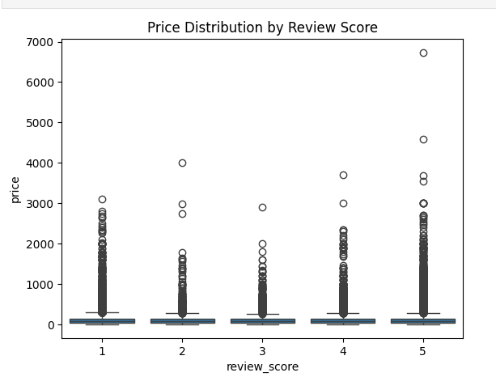
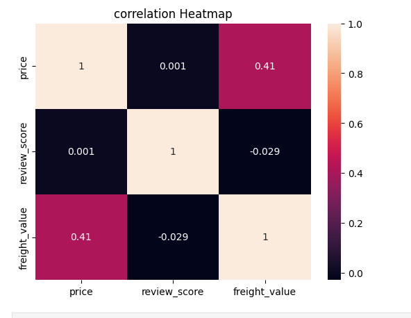

 Brazilian E-commerce Analysis

 Project Overview
Analysis of Brazilian E-commerce public dataset from Kaggle to understand customer behavior and review patterns.

 Tools Used
- Python (Pandas, Matplotlib)
- Power BI

 Steps
1. Data Merging (Orders, Items, Reviews)
2. Data Exploration
3. Missing Values Detection
4. Data Cleaning
5. Data Visualization

 Key Findings
- Most customers give 5-star reviews
- Higher priced products tend to get slightly better reviews
  
  Visualizations

